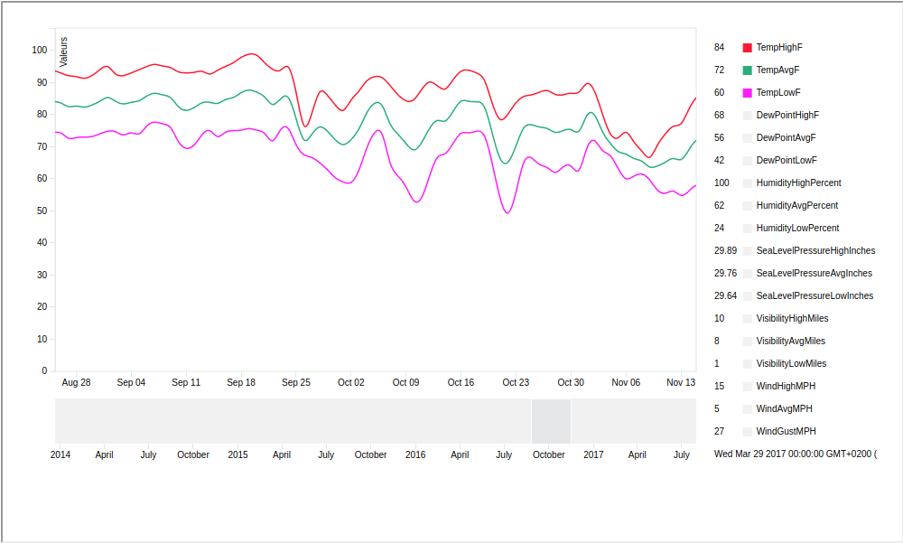
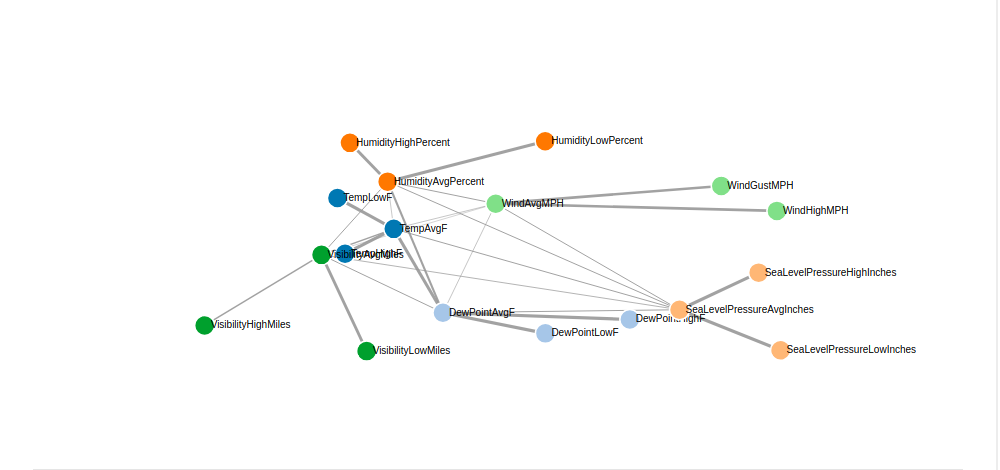
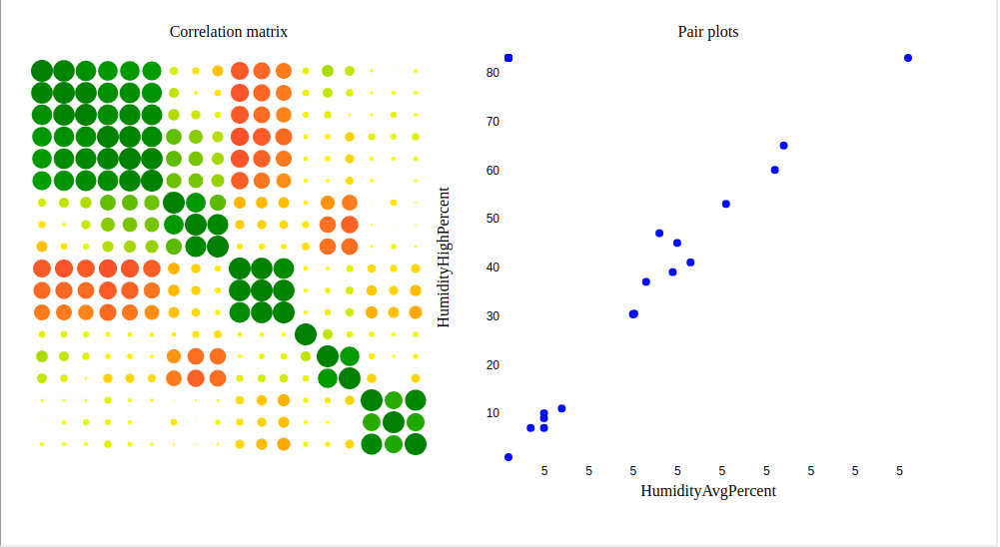

# Données météorologiques quotidiennes pour la station Austin (TEXAS):
Nous avons des données relatives au climat de la ville d’Austin (Capital de l’État de Texas), ces données sont : la température, l’humidité, le niveau de mer, vitesse du vent, ainsi que la visibilité (le degré de brouillard). Nous avons différents statistiques (moyenne, valeurs: Max, Min ). Le besoin pour lequel on compte répondre c’est voir comment ces grandeurs climatiques sont-elle corrélées, faire une régression/un forecasting pour voir comment ces mesures évoluent dans le temps, voir la saisonnalité, la cyclicité ainsi que l’auto-corrélation des observation pour chaque mesure.
Pour se faire, nous avons implémenté 4 graphes qui sont: 
## Graphe 1: Série Temporelle
Ce graphe nous intéresse beaucoup car c’est très pratique de voir des prévisions avec une intervalle de confiance qui rassure l’utilisateur. Il permet aussi de visualiser l’évolution de la température, afin de permettre à la population d’avoir une vue globale sur les données météorologiques.

## Graphe 2: Carte de Chaleur
Calcul des moyennes mensuelles de température et humidité

Présentation des températures ainsi que l’humidité moyennes pour chaque mois (Températures en Fahrenheit ) 
Une nuance de couleur des plus froides au plus chaudes. 
Une tendance légère à la hausse de la température moyenne entre 2014 et 2017 (effet de serre ). 
Ce graphe peut donc servir à avoir une idée sur les conditions climatiques notamment pour les biologistes et agriculteurs ou eventuelement les touristes de la ville de Texas.

## Graphe 3: Graphe de corrélation entre les variables:
Ce graphe nous donne une vision globale sur les corrélations entre les variables. 
Les noeuds représentent les différentes variables du dataSet et les liens les corrélations entres eux.
Plus le lien entre deux variables est opaque, plus les variables sont corrélées.

## Graphe 4: Matrice de corrélation et Paire plot:
Cette matrice de corrélation montre de façon détaillée les corrélations entre les variable.
Un nœud représente une corrélation entre deux variables.
Plus le noeud est vert plus les variables sont corrélées.
Plus le noeud est rouge moins les variables sont corrélées.
Positionnez la souris sur un nœud pour voir la valeur de la corrélation. Cliquez sur le nœud pour visualiser le « Pair plots ». 
Le « Pair plots » permet de la voir la relation entre deux variables. 

