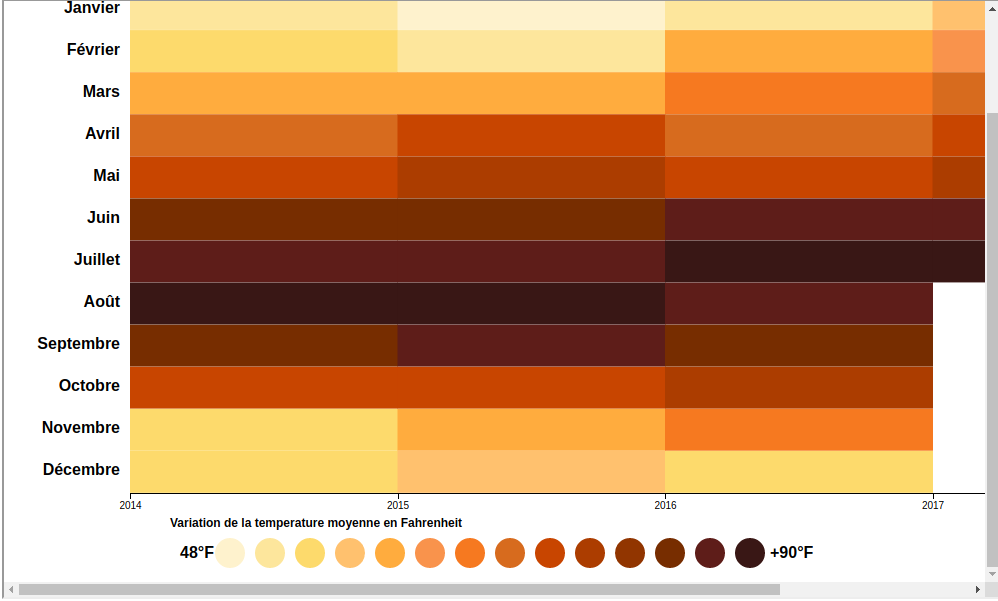

# Daily Weather Data for Austin (TEXAS):
We have data on the climate of the city of Austin, the data are: temperature, sea level, wind speed, as well as fog visibility). We have different statistics (average, values: Max, Min). We need an account on how to react is very much, climate change is correlated, make a regression to see how the measures evolve over time, see seasonality, cyclicity as well as the auto- correlation of observations for each measure.

 Read this in french: [FRENCH](README.fr.md)

To do so, we implemented 4 graphs that are:
## Time Series
This graph interests us a lot because it is very convenient to see forecasts with a confidence interval that reassures the user. It also makes it possible to visualize the evolution of the temperature, in order to allow the population to have a global view on meteorological data.

## Heat Map
Calculation of monthly average temperature and humidity.
Presentation of average temperatures and humidity for each month (Temperatures in Fahrenheit)  
A shade of color from the coldest to the hottest.  
A slight upward trend in average temperature between 2014 and 2017 (greenhouse effect).  
This graph can be used to get an idea of the weather conditions especially for biologists and farmers or possibly tourists in the city of Texas.

## Correlation graph between variables:
This graph gives us a global vision on the correlations between the variables.
The nodes represent the different variables of the dataSet and the links the correlations between them.
The more the link between two variables is opaque, the more the variables are correlated.

## Correlation matrix:
This correlation matrix shows in detail the correlations between the variables.
A node represents a correlation between two variables.
The more the node is green, the more the variables are correlated.
The more the node is red the less the variables are correlated.
Position the mouse on a node to see the value of the correlation. Click on the node to view the "Pair plots".
The "pair plots" allows to see the relationship between two variables.

## Reference:
http://cs109-energy.github.io/ 
https://www.mdpi.com/2073-4433/7/3/35/htm 
https://www.youtube.com/watch?v=n4AfDu--u_I 
Liens vers les données utilisées: https://www.kaggle.com/grubenm/austin-weather 

## Contacts:
DIENG Fallou (fallou.dieng1853@gmail.com)  | MENACER Mahdi (cm_menacer@esi.dz) | BENALI Oussama (oussama.benali@etu.univ-lyon1.fr) | EL GHEZAZ Nassim (nassim.el-ghazaz@etu.univ-lyon1.fr)
 
## Usefull links: 
Data Visualisation: https://lyondataviz.github.io/teaching/lyon1-m2/2018/ 
 
University Lyon 1:https://www.univ-lyon1.fr/ 
   Formation of Data Science:https://master-info.univ-lyon1.fr/DS 